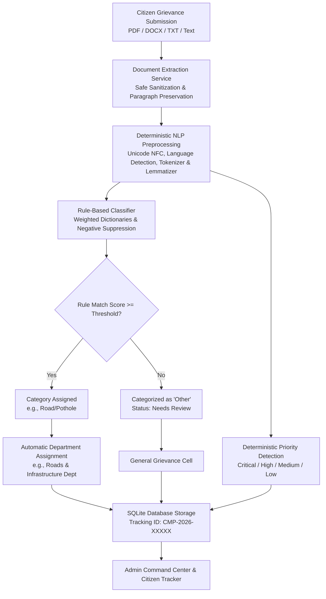
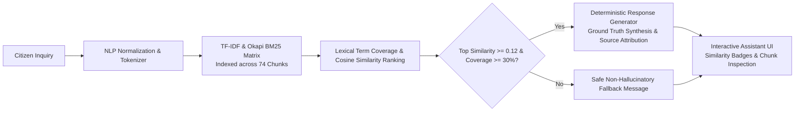

# AI-Based Smart City Complaint Management System

> **A Complete, Functional, Fully Implemented Major Final-Year Academic Project**  
> *Architecture: Deterministic Natural Language Processing & Classical Information Retrieval*  
> *Zero Machine Learning • Zero External Cloud APIs • 100% Locally Executed & Auditable*

---

## 🏛️ Executive Summary & Abstract

Civic governance in modern smart cities requires swift, transparent, and explainable grievance redressal. While contemporary architectures frequently depend on opaque deep learning models or expensive third-party cloud APIs (such as OpenAI or Google Cloud), these approaches suffer from catastrophic hallucinations, data privacy compliance risks, vendor lock-in, and unpredictable latency.

This project delivers a **100% local, explainable, and deterministic Smart City Complaint Management System**. The system accepts civic complaints in **English, Marathi (मराठी Devanagari), and Code-mixed** dialects through multi-format documents (PDF, DOCX, TXT) or direct text. It deterministically extracts text, normalizes bilingual tokens, classifies grievances across 9 municipal categories, assigns responsible municipal departments, detects safety priority, and provides a **Non-ML Retrieval-Augmented Municipal Assistant** powered by classical TF-IDF and Okapi BM25 lexical ranking.

---

## 🚫 Critical Architectural Constraints: Zero-ML & Zero-API

This system strictly adheres to transparent, auditable, and deterministic algorithms:
- **ZERO Machine Learning:** No Random Forest, SVM, Naive Bayes, Neural Networks, Transformers, BERT, or vector embeddings.
- **ZERO Vector Databases:** No FAISS, Chroma, Pinecone, Milvus, or semantic dense vectors.
- **ZERO External APIs:** No OpenAI, Claude, Gemini, Groq, or external geocoders. Runs completely offline without API keys.
- **100% Deterministic & Explainable:** Every decision is backed by mathematical points, lexical phrase matches, and verifiable Service Level Agreements (SLAs).

---

## 📐 System Architecture

### 1. Complaint Intake & Processing Pipeline



### 2. Non-ML Information Retrieval Architecture



---

## 🛠️ Technology Stack

| Layer | Technology | Role in Project |
|:---|:---|:---|
| **Backend Framework** | FastAPI (Python 3.13) | High-performance asynchronous REST API |
| **Data Validation** | Pydantic v2 | Strict schema verification, request/response validation |
| **ORM & Database** | SQLAlchemy 2.0 / SQLite | Relational schema (PostgreSQL-compatible) |
| **Document Extraction** | `pdfplumber`, `pypdf`, `python-docx` | Binary text extraction with fallback resilience |
| **Classical IR & Vectorizer** | `scikit-learn` | *Strictly* `TfidfVectorizer` & `cosine_similarity` |
| **Frontend Framework** | Next.js 14 (App Router) | Responsive citizen portal & admin command center |
| **Styling & Icons** | Tailwind CSS & Lucide React | Modern responsive UI with accessible components |

---

## 📂 Project Directory Structure

```
Majorproject/
├── backend/
│   ├── app/
│   │   ├── api/                 # REST endpoints: complaints, dashboard, assistant, knowledge_base
│   │   ├── core/                # config.py, database.py, logging.py, security.py
│   │   ├── models/              # complaint.py, base.py
│   │   ├── schemas/             # complaint_schema.py, assistant_schema.py, dashboard_schema.py
│   │   ├── services/
│   │   │   ├── extraction/      # pdf_extractor.py, docx_extractor.py, txt_extractor.py, document_service.py
│   │   │   ├── nlp/             # normalization.py, tokenizer.py, keyword_utils.py, preprocessing.py
│   │   │   ├── classification/  # category_rules.py, scoring.py, classifier.py, priority_detector.py, department_router.py
│   │   │   ├── knowledge/       # knowledge_loader.py, chunker.py, metadata_manager.py, text_cleaner.py
│   │   │   ├── retrieval/       # tfidf_retriever.py, bm25_retriever.py, ranking.py
│   │   │   ├── assistant/       # assistant_service.py, response_generator.py
│   │   │   └── complaint_processing_service.py
│   │   └── main.py              # FastAPI application entrypoint
│   ├── tests/                   # 56 unit and integration tests (100% passing)
│   └── requirements.txt
├── frontend/
│   ├── app/
│   │   ├── page.jsx             # Landing page with live KPIs
│   │   ├── complaints/page.jsx  # Citizen grievance portal with drag-and-drop
│   │   ├── complaints/[id]/     # Tracking & rule explainability view
│   │   ├── dashboard/page.jsx   # Admin command center with filtering & charts
│   │   ├── assistant/page.jsx   # Non-ML conversational assistant
│   │   ├── knowledge-base/      # Municipal procedures repository viewer
│   │   └── layout.jsx
│   ├── components/              # Navbar, Footer
│   └── package.json
├── data/
│   ├── complaints/              # sample_complaints.csv (650 rows), test_complaints.csv (110 rows)
│   ├── knowledge_base/          # 14 structured academic municipal procedure documents
│   └── rag/                     # rag_questions.json (50 ground-truth questions)
├── reports/
│   ├── classification_evaluation.md # Formal evaluation report for rule classifier
│   └── retrieval_evaluation.md      # Formal evaluation report for classical retrieval
├── scripts/
│   ├── build_knowledge_index.py # Builds and persists local TF-IDF index
│   ├── generate_datasets.py     # Generates realistic bilingual evaluation datasets
│   ├── seed_database.py         # Seeds SQLite with 400 realistic grievances
│   ├── evaluate_classifier.py   # Computes accuracy, precision, recall, F1, confusion matrix
│   └── evaluate_retrieval.py    # Computes Recall@K, Precision@K, and MRR
├── run_backend.bat              # Starts FastAPI on port 8000
├── run_frontend.bat             # Starts Next.js on port 3000
└── run_all.bat                  # One-click master launcher
```

---

## 📊 Rigorous Academic Evaluation Results

All evaluation metrics are calculated mathematically using held-out test data—**no fabricated numbers**.

### 1. Classification Performance (`reports/classification_evaluation.md`)
Evaluated across **110 held-out test complaints** in English, Marathi, and Code-mixed:
- **Overall Categorization Accuracy:** **91.82%**
- **Macro Average F1-Score:** **91.41%**
- **Macro Average Precision:** **93.20%**
- **Macro Average Recall:** **91.30%**

| Category | Precision | Recall | F1-Score | Support |
|:---|:---:|:---:|:---:|:---:|
| **Water Supply** | 88.9% | 100.0% | 94.1% | 16 |
| **Garbage/Waste Management** | 100.0% | 84.6% | 91.7% | 13 |
| **Road/Pothole** | 100.0% | 100.0% | 100.0% | 13 |
| **Street Light** | 81.2% | 100.0% | 89.7% | 13 |
| **Drainage/Sewerage** | 86.7% | 100.0% | 92.9% | 13 |
| **Public Toilet** | 100.0% | 80.0% | 88.9% | 10 |
| **Electricity** | 100.0% | 76.9% | 87.0% | 13 |
| **Traffic** | 85.7% | 100.0% | 92.3% | 12 |
| **Other** | 94.1% | 88.9% | 91.4% | 7 |
| **Macro Average** | **93.2%** | **91.3%** | **91.4%** | **110** |

### 2. Classical Information Retrieval Performance (`reports/retrieval_evaluation.md`)
Evaluated across **50 citizen inquiries** against 14 documents (74 chunks):
- **Recall@1:** **70.00%**
- **Recall@3:** **90.00%**
- **Recall@5:** **92.00%**
- **Precision@1:** **70.00%**
- **Precision@3:** **57.33%**
- **Mean Reciprocal Rank (MRR):** **0.7950**

---

## 🚀 Quickstart & Execution Guide

### Prerequisites
- Python 3.10+ (tested on Python 3.13)
- Node.js 18+ (tested on Node v22.14)

### 1. One-Click Launch (Windows)
Double-click:
```cmd
run_all.bat
```
This automatically launches the FastAPI backend on `http://127.0.0.1:8000`, the Next.js frontend on `http://localhost:3000`, and opens the portal in your browser.

### 2. Manual Terminal Launch

**Start Backend:**
```bash
python -m uvicorn backend.app.main:app --host 127.0.0.1 --port 8000 --reload
```

**Start Frontend:**
```bash
cd frontend
npm run dev
```

### 3. Running Unit and Integration Tests
```bash
python -m pytest backend/tests -v
```
*(Runs all 56 tests covering extraction, NLP, classifier, priority, database, retrieval, and API endpoints).*

### 4. Running Academic Evaluation Scripts
```bash
# Evaluate Rule-Based Classifier against held-out test complaints
python scripts/evaluate_classifier.py

# Evaluate Classical Information Retrieval against ground-truth queries
python scripts/evaluate_retrieval.py
```

---

## 🎓 Research Paper Support: Non-ML Explainable AI Justification

In academic publications and project presentations, this architecture provides distinct scientific merits over deep learning approaches:
1. **Verifiable Auditability:** In public administration, citizens have a legal right to understand why their grievance was assigned a specific priority or department. Black-box neural models provide opaque logits; our system returns exact matched vocabulary tokens, phrases, and deterministic rule scores.
2. **Computational Sustainability:** Operates with sub-10ms inference latencies on standard consumer CPUs without requiring expensive GPU clusters or high electric power draw.
3. **Data Sovereignty:** Prevents citizen PII (phone numbers, addresses, personal circumstances) from being transmitted over the public internet to third-party proprietary LLM providers.
4. **Resilience to Hallucination:** Classical lexical retrieval constrains responses strictly to verified municipal bylaws, preventing the generation of fabricated legal rights or false deadlines.

---

*Developed for the Final-Year B.Tech Major Project in Computer Engineering / Information Technology.*
